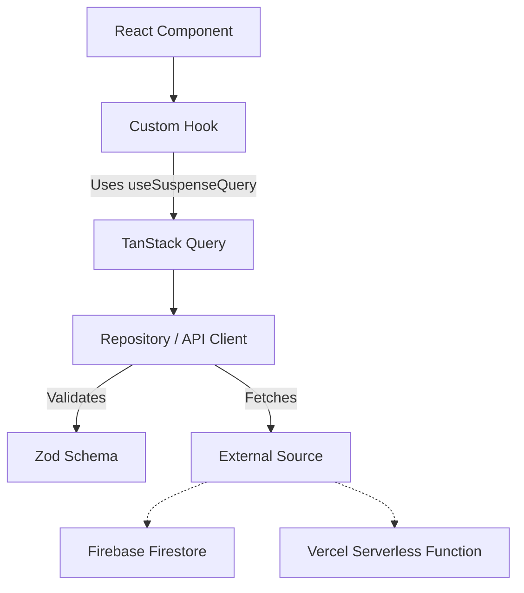

# Data Services Guide

This document outlines the architecture and patterns used in the `src/data-services` layer.

## Architecture Overview

We follow a layered approach to data fetching to ensure separation of concerns, type safety, and efficient caching.



## Directory Structure

*   **`api/`**: Functions that fetch data from HTTP endpoints (e.g., Vercel Serverless Functions).
*   **`repos/`**: Functions that fetch data directly from databases (e.g., Firestore). We use the "Repository Pattern" here.
*   **`hooks/`**: Custom React hooks (wrapping `useSuspenseQuery`) that components consume.
*   **`schemas/`**: Zod schemas used to validate and type incoming data.
*   **`config/`**: Shared constants, specifically Query Keys.

## Established Patterns

### 1. Type Safety with Zod
**Rule**: Never trust external data. Always validate it with Zod.

*   API functions and Repositories **must** define a Zod schema for the expected response.
*   The return type of the function should be inferred from this schema.
*   This ensures that if the API changes or breaks, we fail fast at the boundary with a clear validation error, rather than a confusing runtime crash deep in the UI.

### 2. The Repository/API Function
This function is a pure TypeScript function (not a hook) that performs the async fetch and validation.

*   **Naming**: `get[Entity]By[Param]` (e.g., `getHomePageData`, `getTotalMedianPriceById`).
*   **Responsibilities**:
    1.  Construct URL / Firestore Reference.
    2.  Fetch Data.
    3.  Handle Network Errors (throw meaningful errors).
    4.  **Parse & Validate** with Zod.
    5.  Return typed data.

### 3. The Custom Hook
Wrapper around TanStack Query's `useSuspenseQuery`.

*   **Naming**: `use[Entity]` (e.g., `useHomePageData`).
*   **Usage**:
    *   Imports the Repo/API function.
    *   Imports `QUERY_KEYS` from config.
    *   Returns the query result.
*   **Why Suspense?**: We prefer `useSuspenseQuery` because it allows us to handle recursive loading states with `<Suspense>` boundaries and errors with `<ErrorBoundary>` (or our custom `QueryBoundary`), simplifying component logic (no more `if (isLoading) ...`).

### 4. Query Keys
**Rule**: All Query Keys must be defined in `src/data-services/config/constants.ts` to prevent duplication and cache invalidation issues.

```typescript
// config/constants.ts
export const QUERY_KEYS = {
    HOUSING_DATA_BY_CODE: (lga: string, bm: string) => ['housing', lga, bm],
    //Add new keys here
};
```

## Best Practices for New Features

When adding a new data requirement:

1.  **Define Schema**: Create a new file in `schemas/` (if complex) or define inline in your repo file.
2.  **Create Repo/API**:
    *   If fetching from Firestore -> `src/data-services/repos/[Feature].repo.ts`
    *   If fetching from API -> `src/data-services/api/get[Feature].ts`
3.  **Create Hook**: `src/data-services/hooks/use[Feature].ts`.
4.  **Use in Component**:
    ```tsx
    const { data } = useMyNewFeature(id); // Data is guaranteed to be present and typed
    ```

## Error Handling

*   **Network/Validation Errors**: Should be thrown by the Repo/API function.
*   **UI Handling**: These errors bubble up to the nearest `QueryBoundary` (or `RouteError`).
*   **Avoid**: Catching errors inside the hook just to log them. Let them propagate to the error boundary.
